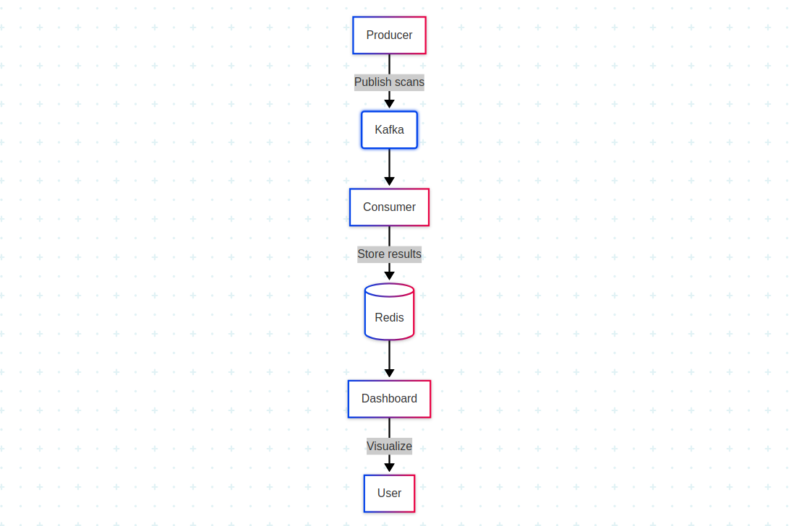
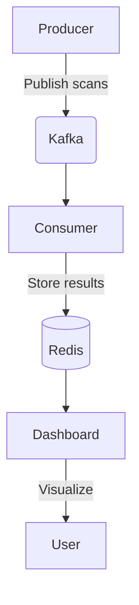

# 🍪 Cookie Monitor


Dashboard: Link:https://github.com/willieaugustine/cookie_monitor/blob/main/docs/cookiedashboard.png

A distributed system for monitoring and analyzing website cookies, with real-time dashboard visualization.Architecture: https://github.com/willieaugustine/cookie_monitor/blob/main/docs/architecture.png
## Architecture






## Features

- **Kafka-based pipeline** for scalable cookie processing
- **Redis-backed storage** for scan results
- **Flask dashboard** with visualization
- **Dockerized** components for easy deployment
- Producer/consumer architecture for scalability

## System Components

| Component       | Description                          | Location           |
|-----------------|--------------------------------------|--------------------|
| Kafka Producer  | Collects cookie data from websites   | `producer/`        |
| Kafka Consumer  | Processes and stores cookie analysis | `consumer/`        |
| Flask Dashboard | Visualizes monitoring results        | `dashboard/`       |
| Redis           | Results caching and storage          | `docker-compose.yml` |
| Kafka/Zookeeper | Message broker infrastructure        | `docker-compose.yml` |

## Prerequisites

- Docker 20.10+
- Docker Compose 2.0+
- Python 3.9+ (for local development)

## 🚀 Quick Start

1. **Clone the repository**:
   ```bash
   git clone https://github.com/willieaugustine/cookie_monitor.git
   cd cookie_monitor
Start the system:

bash
docker-compose up -d --build
Access services:

Dashboard: http://localhost:5000

Kafka UI: http://localhost:8080 (if configured)

Redis CLI: docker exec -it cookie_monitor_redis redis-cli

📦 Component Details
Producer
bash
cd producer
python producer.py --url https://example.com
Configuration:

Set target URLs in producer/config.py

Kafka settings in producer/kafka_config.py

Consumer
The consumer automatically processes messages from Kafka and stores results in Redis.

Key Redis Keys:

latest_scan: Most recent scan results

scan_history: Last 20 scans (as list)

cookie:{name}:{domain}: Individual cookie details

Dashboard
Endpoints:

/: Main dashboard

/api/scans: JSON API of recent scans

/api/scan/<id>: Specific scan details

🔧 Development Setup
Python virtual environment:

bash
python -m venv venv
source venv/bin/activate  # Linux/Mac
venv\Scripts\activate     # Windows
Install dependencies:

bash
pip install -r producer/requirements.txt
pip install -r consumer/requirements.txt
pip install -r dashboard/requirements.txt
Environment variables:
Create .env file:

ini
# Kafka
KAFKA_BOOTSTRAP_SERVERS=localhost:9092
KAFKA_TOPIC=cookie_scans

# Redis
REDIS_HOST=localhost
REDIS_PORT=6379

# Flask
FLASK_SECRET_KEY=your-secret-key
🌐 API Documentation
Scan Results JSON Structure
json
{
  "timestamp": "ISO-8601 datetime",
  "total_cookies": 42,
  "secure_count": 38,
  "http_only_count": 35,
  "samesite_none_count": 5,
  "cookies": [
    {
      "name": "sessionid",
      "domain": ".example.com",
      "secure": true,
      "http_only": true,
      "samesite": "Lax",
      "expiry": "2023-12-31"
    }
  ]
}
🛠️ Troubleshooting
Common Issues:

Kafka not responding:

Wait 1-2 minutes after docker-compose up

Check logs: docker-compose logs kafka

Dashboard not updating:

Verify Redis connection

Check consumer logs: docker-compose logs consumer

Producer errors:

Validate network connectivity

Check Kafka topic exists

🤝 Contributing
Fork the repository

Create a feature branch (git checkout -b feature/your-feature)

Commit changes (git commit -am 'Add some feature')

Push to branch (git push origin feature/your-feature)

Open a Pull Request
